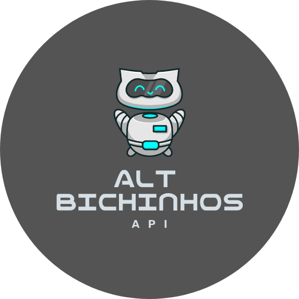

<p align="center">
</a>
</p>
<p align="center">
<a href="https://github.com/ashtrindade/altbichinhos/blob/main/LICENSE.md"></a>

</br>
<a href="https://rapidapi.com/ashtrindade/api/alt-bichinhos"></a>
<a href="https://twitter.com/altbichinhos"></a>
</p>

# Alt Bichinhos API
Welcome to the Alt Pets API! A collection of pet images with alt text!

- Monthly updates. 
- Currently **260** images.
- More languages coming in the future.

Feel free to submit your pet to our <a href="https://twitter.com/altbichinhos">Tweet account.</a> Pre-writen alt text are aways apretiated ♥. 

### Disclaimer: 
We do not own the images, we just added alt text. If you own an image and want it removed, please contact us.

## Languages:

- 
- 
- 
-  - may be some errors.

### Contributions with translation:
- Spanish:
  - <a href="https://twitter.com/smurfdesol">@smurfdesol</a>
  - <a href="https://twitter.com/Starry1086">@Starry1086</a>
  

## Endpoints:
### You can choose the main endpoint with all languages or get by the one specific:

```json
[
  {
    "id": "0095",
    "file": "https://i.imgur.com/kb4E82F.png",
    "portuguese": "A foto mostra um cachorro preto longo e magro, bem peludo. Está deitado de costas, com a cabeça para a direita. Em sua barriga, bem encolhido, está um gatinho também preto. Ele é bem pequeno e encara a câmera com seus olhinhos verdes. Estão deitados no chão, em cima de um tapete azul e branco.",
    "english": "The photo shows a long, skinny, very hairy black dog. He is lying on his back with his head to the right. In her belly, well shrunk, is a black kitten. He is very small and stares at the camera with his little green eyes. They are lying on the floor, on top of a blue and white rug.",
    "spanish": "La foto muestra un perro negro largo, flaco y muy peludo. Está acostado boca arriba con la cabeza hacia la derecha. En su vientre, bien encogido, hay un gatito negro. Es muy pequeño y mira fijamente a la cámara con sus ojitos verdes. Están tirados en el suelo, encima de una alfombra azul y blanca.",
    "german": "Das Foto zeigt einen langen, dünnen, sehr behaarten schwarzen Hund. Er liegt mit dem Kopf nach rechts auf dem Rücken. In ihrem gut geschrumpften Bauch steckt ein schwarzes Kätzchen. Er ist sehr klein und starrt mit seinen kleinen grünen Augen in die Kamera. Sie liegen auf dem Boden, auf einem blau-weißen Teppich."
  }
]
```